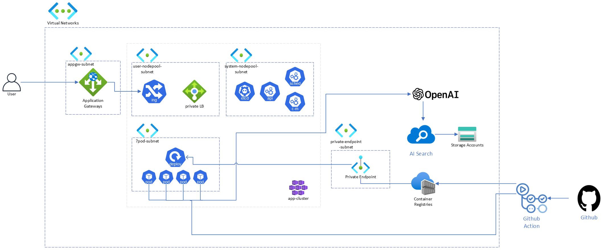

# Cloud-Club-Copilot

클클 5기 핸즈온을 위한 Azure로 클클 전용 코파일럿 만들기

## 사전 준비

신청하실 때 작성한 이메일로 온 초대장으로 제 구독을 사용합니다.

## 아키텍처 & 시나리오 소개

### 아키텍처



### 시나리오

- 목표: 클라우드 클럽 5기의 노션 데이터를 활용해서 클클 GPT 만들기

## Quick Start

1. 해당 레포를 fork 뜬 뒤, Action 탭에 들어가서 workflow 활성화
2. 포크 뜬 레포를 clone, **`VSCode` 에서 open(중요)**
3. `devcontainer`를 사용해서 개발환경을 구성.

> [!note]
> 만약 VScode가 없다면 최소 `Python3.10`, `Node.js 14+`, `Terraform CLI`, `Azure CLI`가 로컬 환경에 세팅되어 있어야 합니다. (웬만하면 VSCode 씁시다..!)

### 로컬에서 앱 실행하기

1. `.env` 파일 만들기
2. `app/start-dev.sh` 실행

  ```bash
  cd app
  source start.sh
  ```

3. `http://localhost:50505` 로 접속

## 실습 시작

실습은 `docs` 폴더에 있는 문서를 참고해주세요.
[🚀 시작하기 🚀](docs/01-intro.md)