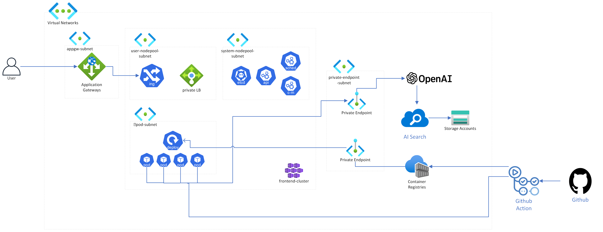

# Cloud-Club-Copilot

클클 5기 핸즈온을 위한 Azure로 클클 전용 코파일럿 만들기

# 사전 준비

- Azure 계정을 한 번도 만들어 본 적 없다면
  - 학생인 분들은 학생 Azure 무료 크레딧을 이용합시다.
  ➡️ [링크](https://azure.microsoft.com/ko-kr/free/students/) 
  - 직장인 도비들은 Azure Free 계정을 만들어서 한 달짜리 크레딧을 사용합시다. 
  ➡️ [링크](https://azure.microsoft.com/ko-kr/free/)
- 이미 학생 크레딧이나 Free 크레딧도 다 썼다고 조사 완료 하신 분들은 신청하실 때 작성한 이메일로 온 초대장으로 제 구독을 사용합니다.

# 아키텍처 & 시나리오 소개

## 아키텍처

## 시나리오

- TBD

# Azure 기본 개념 소개

## Application Gateway

- TBD

## Azure Kubernetes Service(AKS)

- TBD

## Azure OpenAI

- TBD

## Storage Account & Blob storage

- TBD

# 인프라 구성은 Infra as Code(IaC)로

## Azure의 인프라 배포는 어떻게 작동할까?

- ARM Template
- TBD

## Terraform

# 실습 시작

실습은 `docs` 폴더에 있는 문서를 참고해주세요.
