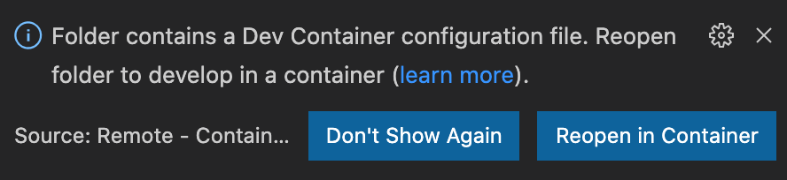

# 환경 세팅하기

## VScode에서 devcontainer 열기

fork한 레포를 VScode에서 열면 오른쪽 하단에 devcontainer로 폴더를 열건지 알림창이 뜨는 분들은 `Reopen in Container` 를 해주세요.


만약 해당 창이 뜨지 않으면 devcontianer extension이 없는거라서, 설치 해준 다음 커맨드 팔레트에서 명령어를 찾아서 동일하게 Container를 실행합니다.


## az login 하기 

```bash
az login
```

## `.env` 파일 다운받기

클클 슬랙을 통해 공유되는 구글 드라이브 파일을 다운 받아서 `app` 폴더에 넣습니다.

## 로컬에서 앱 실행하기

```bash
cd app
source start-dev.sh
```

`http://localhost:50505` 로 접속

## Terraform 으로 인프라 배포하기

시간이 없으니 배포부터 하고 설명 들읍시다...

```bash
cd infra
terraform init 
terraform plan
terraform apply
```