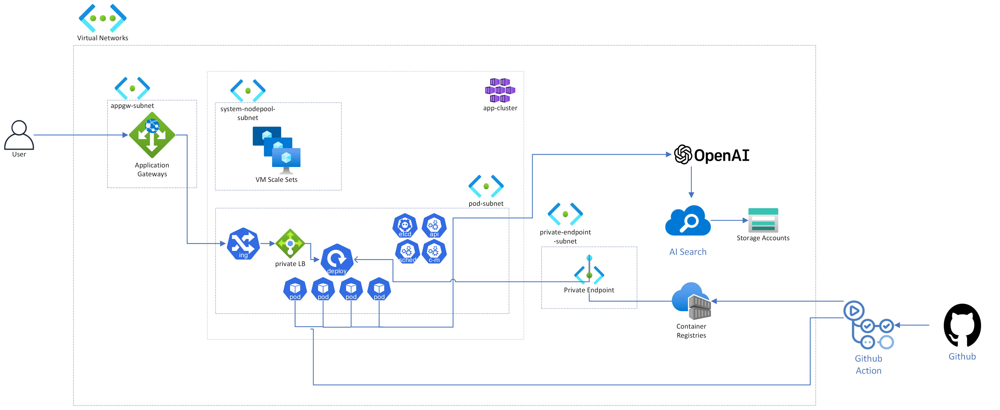

# 시나리오 소개

## 오늘 우리가 할 것

- 클라우드 클럽 GPT를 운영하기 위한 아키텍처를 설계했따!
- 제일 간단하게 할 수 있는 건 PaaS 앱서비스를 이용해서 바로 앱을 배포하는 거지만, 우리는 쿠버네티스를 좋아하는 사람들이 많으니까 쿠버로 한다!

## 미리 만들어 둔 리소스들

- AOAI
- Storage Account & Blob storage
- AI Search
- Document Intelligence