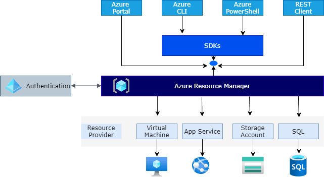

# Azure 소개

## Application Gateway

- L7 Load balancer
  - SSL 오프로딩, cookie-based 세션 affinity, URL 기반 라우팅...
- AWS Elastic LB
- Web Application Firewall 기능
- Application Gateway Ingress Controller?

## Azure Kubernetes Service(AKS)

- Azure의 Managed Kubernetes Cluster
- EKS 
- 네트워크 플러그인 옵션(kubenet, Azure CNI, Azure CNI Overlay..)에 따라 달라지는 pod ip 할당
- Entra(AzureAD)와 연동되는 RBAC 관리 및 접근 제어

- Azure OpenAI 를 호출하는 앱을 AKS에 띄운다.

## Virtual Machine Scale Set

- AWS autoscaling group

## Azure OpenAI

- 다양한 모델 배포 가능
  - Chat
    - gpt3, gpt3.5, gpt3.5-turbo, gpt4, gpt4-turbo, gpt4v
  - Text completion
    - text-davinci-002, text-curie-002
  - Embedding
    - EDA
  - Image
    - DALLE
- 단순히 API 엔드포인트만 제공하는 것이 아니라 RAG, 튜닝, 플러그인, 프롬프트 플로우 기능 제공. Private하게 구성할 수 있게 엔드포인트 설정 가능

## Azure AI Search

- RAG를 위해 데이터 인덱싱 및 vector 값 저장

## Storage Account & Blob storage

- DynamoDB
- export한 클클 노션 / 홈페이지 정보를 저장

## 인프라 구성은 Infra as Code(IaC)로

## Azure의 인프라 배포는 어떻게 작동할까?

- ARM Template 기반
